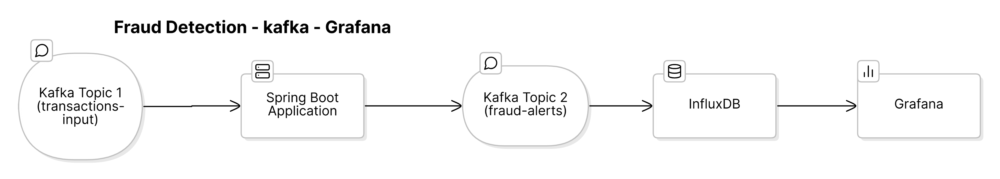
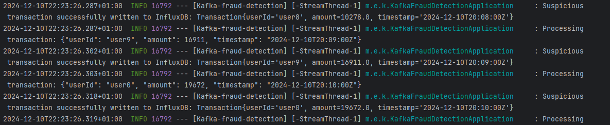
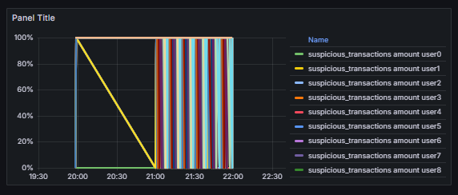
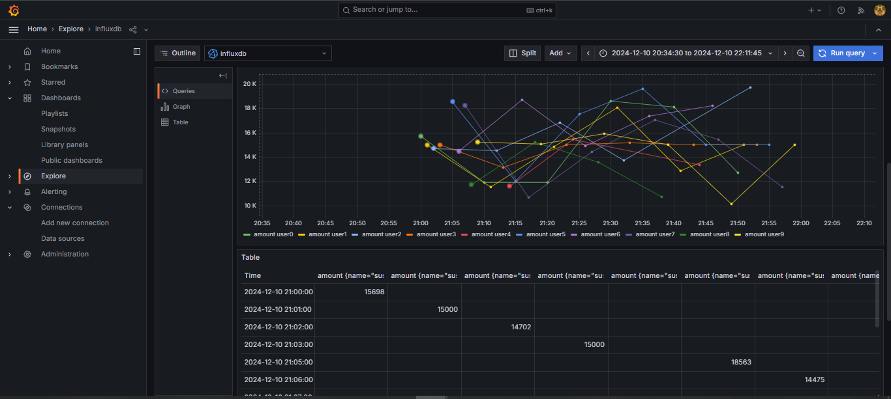
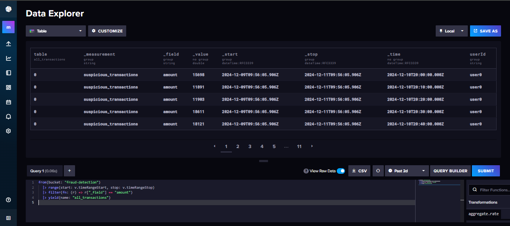

# Kafka Fraud Detection

Kafka Fraud Detection is a system that identifies and analyzes suspicious transactions in real time using Kafka Streams and InfluxDB. The results are visualized through Grafana dashboards.

## System Design

The architecture includes:
- **Kafka Streams**: Processes real-time transaction data.
- **InfluxDB**: Stores transactional data and flagged suspicious transactions.
- **Grafana**: Provides interactive dashboards for visualizing transaction insights.

---

## Example Logs

Below is an example of how suspicious transactions are logged:

---

## Grafana Dashboards

The transactions and flagged suspicious activities are visualized in Grafana:

### Dashboard Overview

### Transaction Insights

---

## InfluxDB Query

Transaction data is stored and queried in InfluxDB. Example of querying suspicious transactions:

---

## Getting Started

Follow these steps to set up and run the project:
1. Start Kafka and InfluxDB services.
2. Use the provided Kafka Producer to push transactions to the `transactions-input` topic.
3. View flagged transactions and insights on Grafana dashboards.

---

## Key Features
- Real-time fraud detection.
- Flexible querying with InfluxDB.
- Interactive visualizations using Grafana.

## Contributions
Contributions are welcome! Please fork the repository and submit a pull request.

